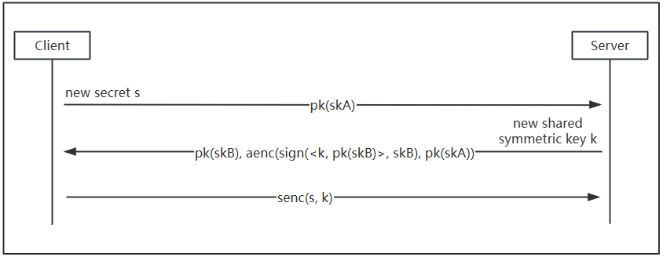

# research-experience
1. Secrecy Verification of Handshake Protocol by Squirrel Prover
The simple Handshake Protocol

3. Implementation and Analysis of Custom Merkle-Damgård Hash Function
4. Research Nostradamus attack(stuck on the diamond tree)
